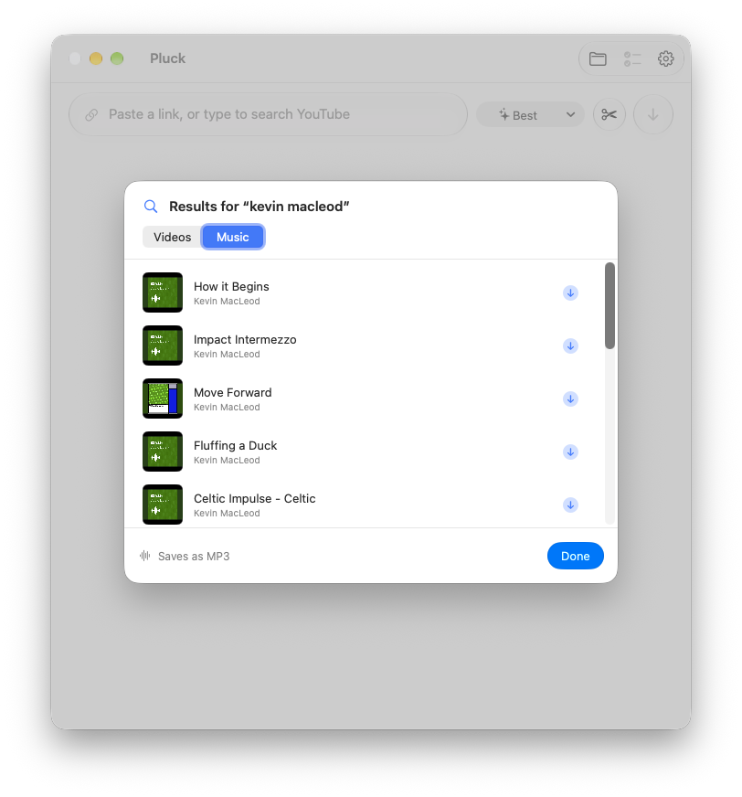
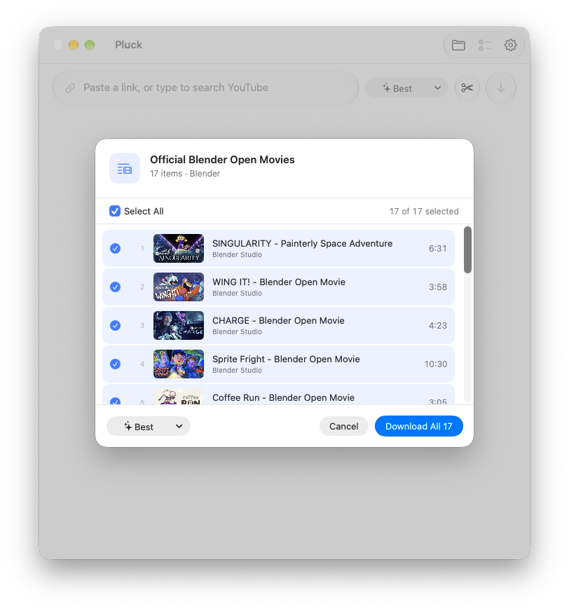

<h1 align="center">Pluck</h1>

<p align="center">
  <b>Download video and music from YouTube, Spotify and almost any website, in a Mac app that feels like it came with your Mac.</b>
</p>

<p align="center">
  <a href="https://github.com/Astrofrogger/pluck/releases/latest/download/Pluck.dmg"><b>⬇︎ Download Pluck for Mac</b></a>
  &nbsp;·&nbsp; free · macOS 14 or later · Apple Silicon & Intel · English & Nederlands
</p>

<p align="center">
  <picture>
    <source media="(prefers-color-scheme: dark)" srcset="docs/screenshots/main-dark.png">
    
  </picture>
</p>

**Paste a link or type what you're looking for, press Return, done.** Pluck is a native SwiftUI front-end for [yt-dlp](https://github.com/yt-dlp/yt-dlp), with Liquid Glass on macOS 26 and later.

- 🔎 **Search right in Pluck:** type a song or video name and download from YouTube Music or YouTube with one click
- 🎵 **Music done properly:** the best audio on offer (256 kbps with YouTube Premium), cover art, tags and lyrics, ready for Apple Music
- 🎬 **Any video quality,** from 360p to 4K, clips of just the part you need, and pause and resume for big downloads
- 🌐 **Almost any website:** 1,800+ sites through yt-dlp, plus Spotify links and pages yt-dlp doesn't know
- ⚡️ **Nothing to install:** Pluck sets up and updates yt-dlp, ffmpeg and Deno for you, and updates itself

<table>
  <tr>
    <td align="center" width="50%">
      <picture>
        <source media="(prefers-color-scheme: dark)" srcset="docs/screenshots/search-dark.png">
        
      </picture>
      <br><b>Search, then download</b><br>Songs from YouTube Music or videos from YouTube, one click each.
    </td>
    <td align="center" width="50%">
      <picture>
        <source media="(prefers-color-scheme: dark)" srcset="docs/screenshots/playlist-dark.png">
        
      </picture>
      <br><b>Pick from playlists</b><br>One video, a few or all of them, from YouTube or Spotify.
    </td>
  </tr>
  <tr>
    <td align="center" width="50%">
      <picture>
        <source media="(prefers-color-scheme: dark)" srcset="docs/screenshots/menubar-dark.png">
        
      </picture>
      <br><b>Lives in your menu bar</b><br>Paste, search and follow progress without opening a window.
    </td>
    <td align="center" width="50%">
      <picture>
        <source media="(prefers-color-scheme: dark)" srcset="docs/screenshots/settings-dark.png">
        
      </picture>
      <br><b>Simple settings</b><br>Formats, file names, lyrics, login at startup, browser cookies.
    </td>
  </tr>
</table>

## Install
Download **[Pluck.dmg](https://github.com/Astrofrogger/pluck/releases/latest/download/Pluck.dmg)**, open it, and drag Pluck into Applications. The first time you open it, go to System Settings → Privacy & Security and click **Open Anyway**, because the app isn't signed with an Apple Developer ID. After that, Pluck checks GitHub for its own updates and installs them when you click **Install & Relaunch**.

## Features

### Getting things in
- **Paste a link** (Pluck fills it in from the clipboard when you switch to it), drag one onto the window, or **type words to search** YouTube Music (songs) or YouTube (videos)
- **Playlists:** paste a YouTube playlist or a Spotify album or playlist and pick what you want. Items you already have are marked
- **From any app:** a shortcut you choose (⌃⌥⌘D by default) downloads the link you copied, without switching to Pluck. Or right-click a link or text and choose **Services → Download with Pluck**
- **From your browser:** a one-click bookmark (see below) sends the page you're on to Pluck
- **Spotify:** track, album and playlist links. Spotify audio is DRM-protected, so Pluck finds the matching song on YouTube Music and tags the file with Spotify's title, artist, album and a square cover
- **Almost any website:** yt-dlp supports 1,800+ sites. When it doesn't recognise a page, Pluck loads the page in an invisible browser, lets the player start (muted) and downloads the stream it finds, including embedded Vimeo, YouTube, Dailymotion, Twitch and SoundCloud players. DRM-protected streams are never downloaded. Sites that need a login use your browser's cookies (Safari, Chrome, Firefox, Zen, Brave, Edge, Vivaldi, Opera or Chromium)

### Quality
- **Video:** Best, 4K, 1440p, 1080p, 720p, 480p or 360p, in H.264 (plays everywhere) or AV1/VP9, as MP4, MKV or WebM, optionally preferring 60 fps
- **Audio:** original, M4A, MP3, Opus, FLAC or WAV. Pluck takes the best source and only converts when it has to. With YouTube Premium (and your browser's cookies) that's about 256 kbps instead of 128. Every download shows the quality it actually got
- **Clips:** click the scissors to download only part of a video, e.g. from 1:30 to 2:45

### Music
- **Lyrics** from [LRCLIB](https://lrclib.net) are written into MP3, M4A and FLAC files, so they show up in Apple Music and on iPhone
- **Cover art and tags** (title, artist, album) are embedded automatically

### Your files
- **Named your way:** Automatic (Artist - Title for music), Title, Artist - Title, Title (Year), Channel - Title, or your own pattern like `{artist} - {title} ({year})`
- **Albums and playlists** go into their own folders (`Artist/Album`)
- **Already downloaded?** Pluck notices and offers to show the file instead
- **Your downloads stay listed** after quitting. Drag one straight into Finder, Mail or your editor, or select it and press Space for Quick Look

### Downloading
- **Pause and resume,** even after quitting Pluck
- **Automatic retry** when the connection drops: Pluck waits for the internet to come back and continues where it stopped
- Up to 3 downloads at a time (adjustable), with live progress, speed and time left
- Notifications when downloads finish in the background, and a Dock badge

### On your Mac
- **Menu bar icon** with a progress ring. Closing the window keeps Pluck running in the menu bar until you choose Quit. It can open at login, in the menu bar only
- **English and Dutch,** following your Mac's language (or pick one for Pluck in System Settings → General → Language & Region → Applications)
- **Works with VoiceOver:** every control has a proper label
- **Manages its own tools:** yt-dlp (official release, optional nightly builds), ffmpeg/ffprobe ([signed static builds](https://ffmpeg.martin-riedl.de)) and Deno (the JavaScript runtime yt-dlp needs for YouTube). It checks daily, verifies every download's checksum, and for ffmpeg and Deno also the developers' signatures
- **Updates itself** from GitHub releases with one click

## Download from your browser
Add a bookmark with this as its address, and click it on any page to send that page to Pluck:
```
javascript:location.href='pluck://download?url='+encodeURIComponent(location.href)
```
Pluck opens with the link filled in; press Return to start. (A `pluck://` link never starts a download by itself, so websites can't trigger downloads.)

## Requirements
macOS 14 Sonoma or later, on Apple Silicon or Intel. On macOS 26 and later it uses Liquid Glass; older versions get the standard macOS look. Nothing else is needed: on first launch Pluck downloads yt-dlp, ffmpeg/ffprobe and Deno into `~/Library/Application Support/Pluck/bin` and keeps them updated. To use your own Homebrew copies instead, turn off auto-update in Settings → Advanced.

## Release
```bash
./scripts/release.sh 1.7.0 "What changed"
```
This bumps the version, builds the app, uploads `Pluck.dmg`, `Pluck.zip` and `Pluck.zip.sha256` to a GitHub release, and tags it. Running copies of Pluck pick up the new version within a day, or straight away with Pluck → Check for Updates….

## Translations
Strings live in `Resources/Localizable.xcstrings` (a String Catalog you can open in Xcode). After changing text in the code, run `./scripts/update-strings.sh` to add new strings to the catalog, then translate them.

## Build
```bash
./scripts/build-app.sh            # → build/Pluck.app
./scripts/build-app.sh --install  # also copies it to /Applications
```

---
<sub>Screenshots show <a href="https://studio.blender.org/films/">Blender Studio open movies</a> (CC BY), music by <a href="https://incompetech.com">Kevin MacLeod</a> (CC BY) and a Spotify track. Pluck is meant for content you have the right to download.</sub>
