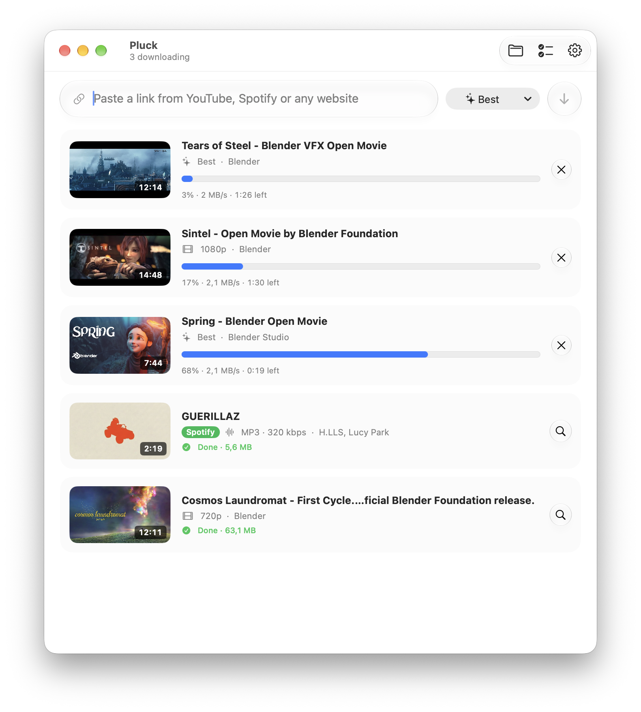
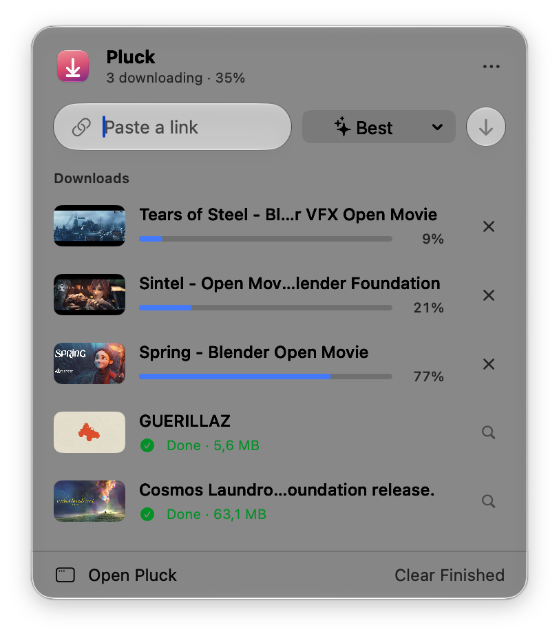
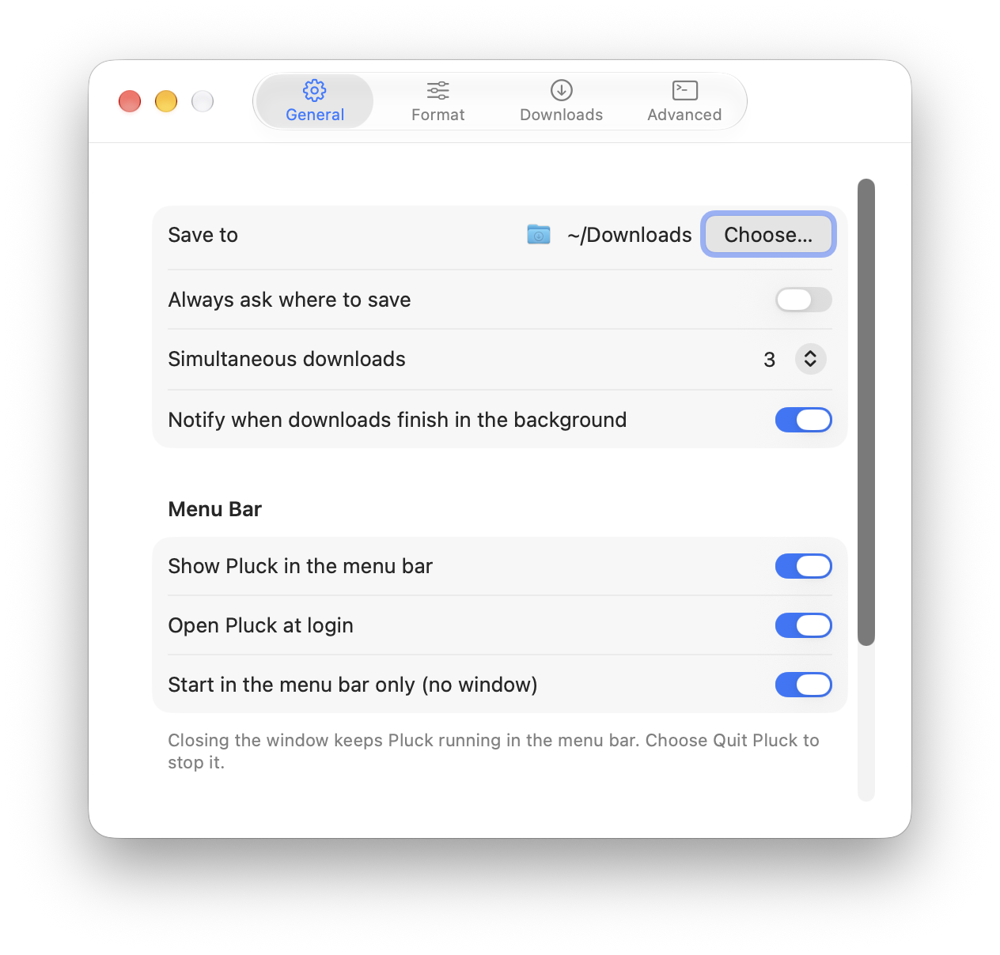

<h1 align="center">Pluck</h1>

<p align="center">
  <b>Download video and music from YouTube, Spotify and almost any website, in a Mac app that feels like it came with your Mac.</b>
</p>

<p align="center">
  <a href="https://github.com/Astrofrogger/pluck/releases/latest/download/Pluck.dmg"><b>⬇︎ Download Pluck for Mac</b></a>
  &nbsp;·&nbsp; free · macOS 14 or later · Apple Silicon & Intel
</p>

<p align="center">
  <picture>
    <source media="(prefers-color-scheme: dark)" srcset="docs/screenshots/main-dark.png">
    
  </picture>
</p>

**Paste a link, press Return, done.** Pluck is a native SwiftUI front-end for [yt-dlp](https://github.com/yt-dlp/yt-dlp) with Liquid Glass on macOS 26 and later.

- 🎬 **Any quality:** from 360p to 4K, with H.264 so files play everywhere, or AV1/VP9 for smaller, sharper files
- 🎵 **Spotify links:** tracks, albums and playlists, saved as MP3, M4A, FLAC and more, tagged with title, artist and cover art
- 🌐 **Almost any website:** 1,800+ sites through yt-dlp, and when a page isn't supported Pluck finds the video on the page itself
- ⚡️ **Nothing to install:** Pluck sets up and updates yt-dlp, ffmpeg and Deno for you, and updates itself

<table>
  <tr>
    <td align="center" width="50%">
      <picture>
        <source media="(prefers-color-scheme: dark)" srcset="docs/screenshots/menubar-dark.png">
        
      </picture>
      <br><b>Lives in your menu bar</b><br>Paste a link and follow progress without opening a window.
    </td>
    <td align="center" width="50%">
      <picture>
        <source media="(prefers-color-scheme: dark)" srcset="docs/screenshots/settings-dark.png">
        
      </picture>
      <br><b>Simple settings</b><br>Save folder, formats, login at startup, browser cookies.
    </td>
  </tr>
</table>

## Install
Download **[Pluck.dmg](https://github.com/Astrofrogger/pluck/releases/latest/download/Pluck.dmg)**, open it, and drag Pluck into Applications. The first time you open it, go to System Settings → Privacy & Security and click **Open Anyway**, because the app isn't signed with an Apple Developer ID. After that, Pluck checks GitHub for its own updates and installs them when you click **Install & Relaunch**.

## Features
- Paste a link (it auto-fills from the clipboard when you switch to the app), or drag one onto the window
- **Video:** Best, 4K, 1440p, 1080p, 720p, 480p or 360p. Codec is H.264 (plays everywhere) or AV1/VP9, container is MP4, MKV or WebM, with an optional 60 fps preference
- **Audio:** original, M4A, MP3, Opus, FLAC or WAV, at Best VBR or 320/256/192/128 kbps
- **Spotify:** track, album and playlist links. Spotify audio is DRM-protected, so Pluck finds the matching song on YouTube Music and tags the file with Spotify's title, artist, album and a square cover
- Up to 3 downloads at a time (adjustable); the rest wait in a queue
- **Any website:** yt-dlp supports 1,800+ sites. When it doesn't recognise a page, Pluck loads the page in an invisible browser, lets the player start (muted), and downloads the stream it finds. It also spots embedded Vimeo, YouTube, Dailymotion, Twitch and SoundCloud players. DRM-protected streams are never downloaded. Sites that need a login (Vimeo, Instagram…) use your browser's cookies, set in Settings → Advanced
- **Menu bar icon:** paste a link, pick a format, and watch progress without opening the main window. Closing the window keeps Pluck running in the menu bar (no Dock icon) until you choose Quit. Settings → General can open Pluck at login and start it in the menu bar only
- Live progress, speed and ETA, with thumbnails and durations
- Dock badge, plus notifications when a download finishes in the background
- **Settings (⌘,):**
  - Save folder, or "always ask where to save"
  - Format defaults
  - Embed metadata, cover art and subtitles
  - SponsorBlock and playlist downloads
  - Browser cookies from Safari, Chrome, Firefox, Zen, Brave, Edge, Vivaldi, Opera or Chromium
- **Manages its own tools:** yt-dlp (official release, optional nightly builds), ffmpeg/ffprobe ([signed static builds](https://ffmpeg.martin-riedl.de)) and Deno (the JavaScript runtime yt-dlp needs for YouTube). It checks daily and verifies every download's SHA-256 checksum
- **Updates itself** from GitHub releases with one click
- ⇧⌘D downloads whatever link is on the clipboard

## Requirements
macOS 14 Sonoma or later, on Apple Silicon or Intel. On macOS 26 and later it uses Liquid Glass; older versions get the standard macOS look. Nothing else is needed: on first launch Pluck downloads yt-dlp, ffmpeg/ffprobe and Deno into `~/Library/Application Support/Pluck/bin`, and keeps them updated. To use your own Homebrew copies instead, turn off auto-update in Settings → Advanced.

## Release
```bash
./scripts/release.sh 1.2.1 "What changed"
```
This bumps the version, builds the app, uploads `Pluck.dmg`, `Pluck.zip` and `Pluck.zip.sha256` to a GitHub release, and tags it. Running copies of Pluck pick up the new version within a day, or straight away with Pluck → Check for Updates….

## Build
```bash
./scripts/build-app.sh            # → build/Pluck.app
./scripts/build-app.sh --install  # also copies it to /Applications
```

---
<sub>Screenshots show <a href="https://studio.blender.org/films/">Blender Studio open movies</a> (CC BY) and a Spotify track. Pluck is meant for content you have the right to download.</sub>
